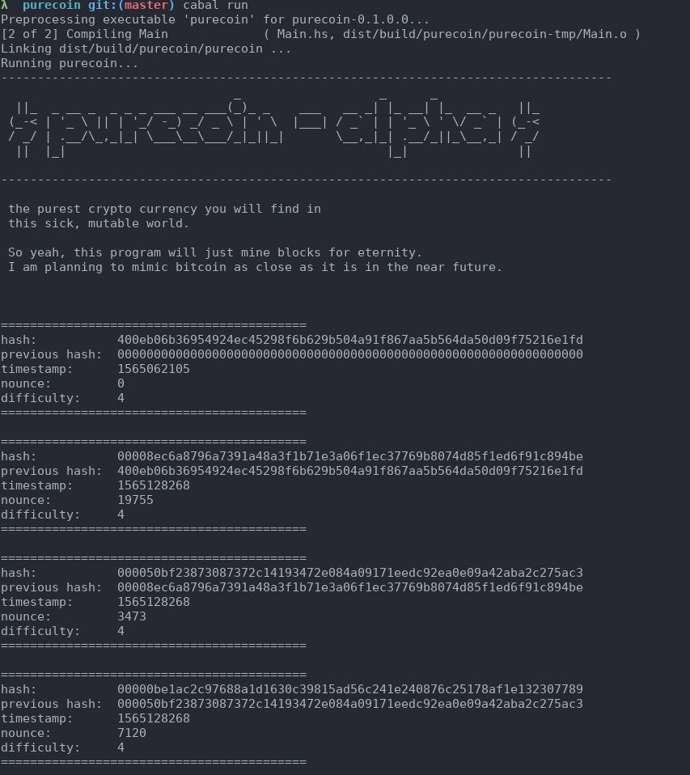

# Purecoin
The purest crypto currency you will find in this sick, mutable world.

## What is Purecoin
It's just a fun little project I started. I want to re-implement bitcoin in a pure language.

## Why?
I recently finished a class about distributed systems and I got hooked on the bitcion consensus
algorithm. I think it's fascinating and I have fun writing code about it.

I also love haskell, but I don't use it in my day to day life so why not use it for this project :)

## Roadmap
This is pretty general as of now, but I expect to go as deep as possible in all of those categories.
I will eventually add more goals under each categories.

- [ ] miners
- [ ] miners network
- [ ] client
- [ ] wallet
- [ ] local transaction persistence

# How to start mining useless blocks
You will need haskell and cabal installed.

1. Clone the repo
2. Create a cabal sandbox
```
$ cabal sandbox init
```
3. Install dependencies
```
$ cabal install
```
4. Run the program
```
$ cabal run
```

